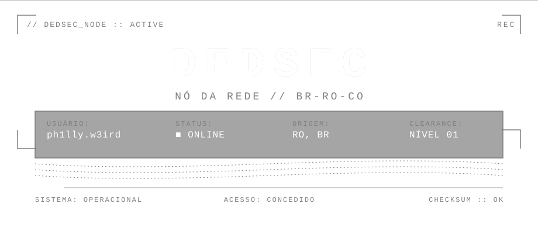
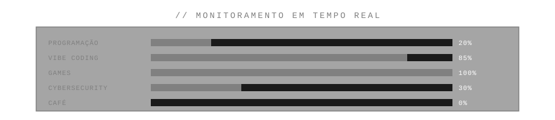
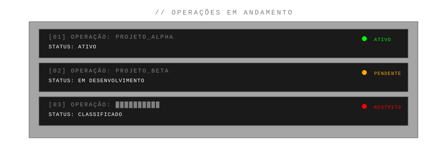

<div align="center">

<picture>
  <source media="(prefers-color-scheme: dark)" srcset="./assets/banner-dark.svg">
  <source media="(prefers-color-scheme: light)" srcset="./assets/banner-light.svg">
  
</picture>


</div>

---

## `[ IDENTIFICAÇÃO DO USUÁRIO ]`

<picture>
  <source media="(prefers-color-scheme: dark)" srcset="./assets/hero-dark.svg">
  <source media="(prefers-color-scheme: light)" srcset="./assets/hero-light.svg">
  
</picture>

---

## `[ SOBRE MIM ]`

```
> Olá, amigo.
```

```
Não sou hacker profissional.
Não sou desenvolvedor profissional.
Não vou fingir que tenho experiência que não tenho.

Sou Philly, tenho 19 anos e moro no Colorado do Oeste, Rondônia.
Sou brasileiro. Gosto de games, computadores e tecnologia.

A programação, por enquanto, é um hobby — um dos mais divertidos
que já tive. Chamo de vibe coding: pego uma ideia, sento no
computador, e vejo até onde consigo chegar.

A cybersecurity me desperta uma curiosidade enorme.
Não sei se vou seguir isso profissionalmente.
Mas sei que quero descobrir.

Talvez um dia isso vire uma carreira em TI.
Talvez eu só continue fazendo coisas por diversão.
De qualquer forma, estou apenas começando.

E isso, pra mim, já é suficiente.
```

---

## `[ ESTADO ATUAL DO SISTEMA ]`

<div align="center">

<picture>
  <source media="(prefers-color-scheme: dark)" srcset="./assets/status-dark.svg">
  <source media="(prefers-color-scheme: light)" srcset="./assets/status-light.svg">
  
</picture>

</div>

---

## `[ TECNOLOGIAS ]`

```
$ ls -la ./toolbox/

LINGUAGENS
├── JavaScript ............ explorando
├── Python ................ explorando
├── HTML/CSS .............. construindo
└── Markdown .............. dominando (irônico)

FERRAMENTAS
├── Git ................... aprendendo
├── VS Code ............... diariamente
├── Linux ................. curiosidade
└── GitHub ................ operacional

ÁREAS DE INTERESSE
├── Cybersecurity ......... fascinado
├── Redes ................. estudando
├── Sistemas .............. desmontando
└── Vibe Coding ........... sempre ativo

STATUS: curioso demais para ser perigoso.
```

---

## `[ OPERAÇÕES ]`

<div align="center">

<picture>
  <source media="(prefers-color-scheme: dark)" srcset="./assets/operations-dark.svg">
  <source media="(prefers-color-scheme: light)" srcset="./assets/operations-light.svg">
  
</picture>

</div>

> *Adicione seus projetos reais aqui. Remova os placeholders.*

---

## `[ VIBE CODING ]`

<div align="center">

<picture>
  <source media="(prefers-color-scheme: dark)" srcset="./assets/pipeline-dark.svg">
  <source media="(prefers-color-scheme: light)" srcset="./assets/pipeline-light.svg">
  
</picture>

</div>

```
vibe coding não é profissão — é como eu construo.

sem especificações rígidas. sem planejamento excessivo.
só uma ideia, uma IA do meu lado, e o loop:
escrever, quebrar, consertar, publicar.

a IA não substitui o pensamento.
ela programa na velocidade do pensamento.
```

---

## `[ OFFLINE MODE ]`

```
> quando o terminal dorme, outra tela acende.

games são caos de baixo risco — o único lugar onde
quebrar tudo é literalmente o objetivo.

STATUS: jogando quando deveria estar codando.
```

---

## `[ ESTATÍSTICAS DO NÓ ]`

<div align="center">

```
╔════════════════════════════════════════════════════════════════════════╗
║                                                                        ║
║                 DADOS DO NÓ — ph1lly.w3ird                             ║
║                                                                        ║
╚════════════════════════════════════════════════════════════════════════╝
```


</div>

---

## `[ CANAIS DE COMUNICAÇÃO ]`

```
╔════════════════════════════════════════════════════════════════════════╗
║  CANAL            │ STATUS         │ CRIPTOGRAFIA                     ║
╠═══════════════════╪════════════════╪══════════════════════════════════╣
║  GitHub           │ OPERACIONAL    │ PÚBLICO                          ║
║  Email            │ ATIVO          │ PRIVADO                          ║
║  Discord          │ EM ESCUTA      │ CRIPTOGRAFADO                    ║
║  LinkedIn         │ STANDBY        │ PROFISSIONAL                     ║
╚════════════════════════════════════════════════════════════════════════╝

0 portas abertas. todos os canais criptografados de ponta a ponta.
```

> *Substitua pelos seus links reais.*

---

## `[ ROADMAP ]`

```
╔════════════════════════════════════════════════════════════════════════╗
║                                                                        ║
║                    EVOLUÇÃO DO SISTEMA                                 ║
║                                                                        ║
╚════════════════════════════════════════════════════════════════════════╝

[01] HOBBY
 │   programação como diversão
 │
 ▼
[02] APRENDIZADO
 │   explorando linguagens, ferramentas, conceitos
 │
 ▼
[03] PROJETOS
 │   construindo coisas reais, quebrando, consertando
 │
 ▼
[04] MAIS PROJETOS
 │   refinando, organizando, documentando
 │
 ▼
[05] CYBERSECURITY
 │   mergulhando fundo em segurança da informação
 │
 ▼
[06] TI / CARREIRA
 │   transformando curiosidade em profissão
 │
 ▼
[07] ???
     o sistema ainda não terminou de carregar.
```

---

## `[ EASTER EGGS ]`

```
╔════════════════════════════════════════════════════════════════════════╗
║                                                                        ║
║                      EASTER EGGS DETECTADOS                            ║
║                                                                        ║
╚════════════════════════════════════════════════════════════════════════╝

> you found something.

> "Hello, friend."
   └── Mr. Robot — Temporada 1, Episódio 1.
       Se você reconheceu, provavelmente também já
       ficou acordado até 3AM maratonando.

> "we're anonymous. we're legion. we do not forgive. we do not forget."
   └── expect the unexpected.

> "one shot, one opportunity."
   └── Mom's spaghetti.

> "the system is watchful."
   └── DedSec always sees. Even when you think you're invisible.
```

```
> easter egg #4: se você encontrou isso,
  parabéns. você gosta de ler coisas que ninguém lê.
  isso te torna um dos meus. seja bem-vindo ao nó.
```

---

<div align="center">

```
╔════════════════════════════════════════════════════════════════════════╗
║                                                                        ║
║   "continue estranho."                                                 ║
║                                                                        ║
║                          — ph1lly.w3ird                                 ║
║                                                                        ║
║   [ FIM DA TRANSMISSÃO ]                                               ║
║                                                                        ║
╚════════════════════════════════════════════════════════════════════════╝
```


</div>

---

<div align="center">

<picture>
  <source media="(prefers-color-scheme: dark)" srcset="./assets/footer-dark.svg">
  <source media="(prefers-color-scheme: light)" srcset="./assets/footer-light.svg">
  
</picture>

</div>
