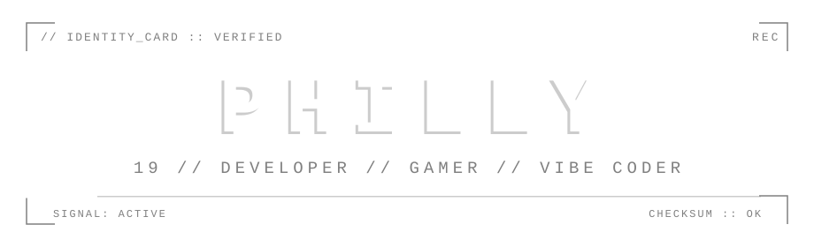
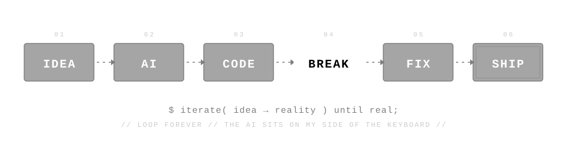
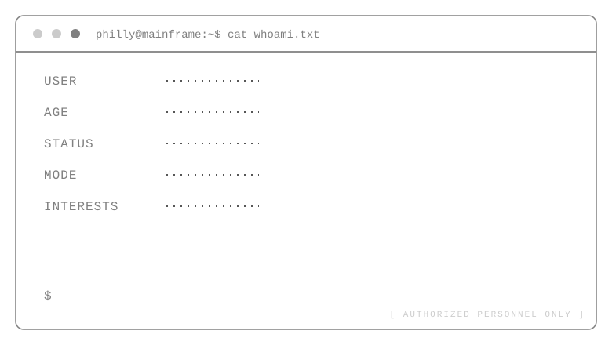
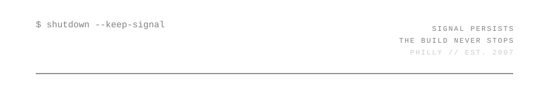

<div align="center">

<picture>
  <source media="(prefers-color-scheme: dark)" srcset="./assets/hero-dark.svg">
  <source media="(prefers-color-scheme: light)" srcset="./assets/hero-light.svg">
  
</picture>

```bash
$ whoami
philly — signal active
$ uptime
19 years // still building
```

</div>

---

## `// ABOUT_ME`

```
hey — I'm Philly. 19.

I break things, fix them, and occasionally they even work afterward.
Most of my time goes into code, games, and talking to AIs until some
random 2AM idea turns into something real.

I'm not here to look professional.
I'm here to build, learn, and see how far curiosity goes.
```

---

## `// VIBE_CODING`

<div align="center">

<picture>
  <source media="(prefers-color-scheme: dark)" srcset="./assets/pipeline-dark.svg">
  <source media="(prefers-color-scheme: light)" srcset="./assets/pipeline-light.svg">
  
</picture>

</div>

```
vibe coding isn't a job title — it's how i build.

no rigid specs. no overplanning. just an idea, an AI on my side of the
keyboard, and the loop: write it, break it, fix it, ship it.

the AI doesn't replace the thinking.
it pair-programs at the speed of thought.
```

<details>
<summary><b>▸ view raw pipeline</b></summary>
<br>

```
        IDEA
         │
         ▼
         AI          ← pair programmer, not autopilot
         │
         ▼
        CODE         ← fastest keyboard in the wasteland
         │
         ▼
        BREAK        ← guaranteed, every time
         │
         ▼
        FIX          ← stack trace? never heard of her
         │
         ▼
        SHIP ────► back to IDEA
```

</details>

---

## `// SYSTEM_PROFILE`

<div align="center">

<picture>
  <source media="(prefers-color-scheme: dark)" srcset="./assets/terminal-dark.svg">
  <source media="(prefers-color-scheme: light)" srcset="./assets/terminal-light.svg">
  
</picture>

</div>

---

## `// OPERATIONS`

```
$ cat operations.log
```

> projects load here as they declassify. active builds first.

<details>
<summary><b>[01] OPERATION: PROJECT_NAME — STATUS: ACTIVE</b></summary>

```
STACK ..... [TECH]
BRIEF ..... [one-line description of what it does]
STATE ..... [what's currently being built / broken]
```

`[REPO_LINK]`

</details>

<details>
<summary><b>[02] OPERATION: PROJECT_NAME — STATUS: IN DEV</b></summary>

```
STACK ..... [TECH]
BRIEF ..... [one-line description]
STATE ..... [current state]
```

`[REPO_LINK]`

</details>

<details>
<summary><b>[03] OPERATION: ████████ — STATUS: REDACTED</b></summary>

```
ACCESS DENIED — clearance level insufficient.
(translation: it's not ready yet.)
```

</details>

---

## `// TOOLS`

```
$ ls -la ./toolbox

drwxr-xr-x  philly  [LANGUAGE]
drwxr-xr-x  philly  [FRAMEWORK]
drwxr-xr-x  philly  [DATABASE]
drwxr-xr-x  philly  [AI_TOOL]
drwxr-xr-x  philly  [OTHER]
```

---

## `// OFFLINE_MODE`

```
> when the terminal sleeps, another screen wakes up.

games are low-stakes chaos — the one place where
breaking everything is literally the objective.

currently playing: [GAME_TITLE]
```

---

## `// ACTIVITY`

<div align="center">

<a href="https://github.com/PHILLY_USERNAME">
  <picture>
    <source media="(prefers-color-scheme: dark)"
      srcset="https://github-readme-stats.vercel.app/api?username=PHILLY_USERNAME&show_icons=true&hide_border=true&bg_color=00000000&title_color=ffffff&text_color=808080&icon_color=ffffff&include_all_commits=true&count_private=true">
    <source media="(prefers-color-scheme: light)"
      srcset="https://github-readme-stats.vercel.app/api?username=PHILLY_USERNAME&show_icons=true&hide_border=true&bg_color=00000000&title_color=000000&text_color=606060&icon_color=000000&include_all_commits=true&count_private=true">
    
  </picture>
</a>

</div>

---

## `// CONNECTION`

```
$ netstat -channels

EMAIL      ......... [REPLACE_EMAIL]
DISCORD    ......... [REPLACE_DISCORD]
INSTAGRAM  ......... [REPLACE_INSTAGRAM]
LINKEDIN   ......... [REPLACE_LINKEDIN]
WEBSITE    ......... [REPLACE_WEBSITE]

0 open ports. all channels end-to-end encrypted.
```

---

<div align="center">

<picture>
  <source media="(prefers-color-scheme: dark)" srcset="./assets/footer-dark.svg">
  <source media="(prefers-color-scheme: light)" srcset="./assets/footer-light.svg">
  
</picture>


</div>
